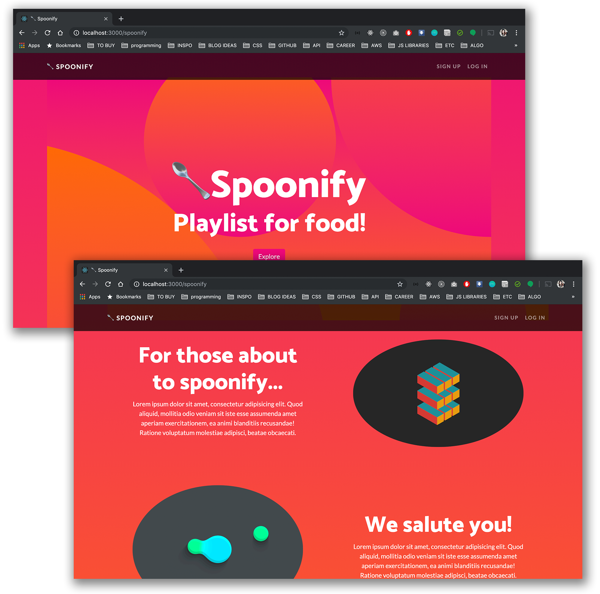

# Spoonify🥄

Thank you for using Spoonify. This is a full Ruby on Rails web app for restaurant recommendations between friends and family.

View [demo](https://youtu.be/bWe333-MJ80)

## Contents

- [Landing Page](#landing-page)
- [Installation](#installation)
- [Models / Relationship](#models--relationship)
- [Future Development](#future-development)

## Landing Page



## 🛠Installation

To get started with Spoonify, fork and clone this repository to your local computer, ```cd``` into the project, and run ```bundle install```. Make sure you have the right Ruby version. (2.5.3)

## ⛵️Models / Relationship

Spoonify utilizes five models:

### 👩‍💼User

The ```user``` model handles the self-referential relationship between the users; users can follow each other and be followed by each other as well. It has foreign keys for ```follower``` and ```followed``` in order for users to follow and to be followed simultaneously. Also it manages all the aspects of user accounts, including login/signup, and updating account information.

### 👭Following

Spoonify uses the self-referential relationship model, establishing one direction relationship at a time. Users can follow other users, as well as receive follower, but they are not able to follow themselves. When two users follow each other, there are two instances of the ```following``` in the database.

### 📚List

User is able to create many lists containing many restaurants. As a user, you are able to create, update, and delete lists. Each list is searchable by its title and view-able depending on whether it is set to public or not.

### 🍽Restaurant

The ```restaurant``` model belongs to a ```list``` model, and has many ```reservation``` instances. Each restaurant has a name and a Yelp URL for more information. Also, it has custom validations for its name and a Yelp URL.

### 📍Reservation

The ```reservation``` model belongs to the signed in user and a restaurant. As a user, you are able to create many reservations at multiple restaurants.

## 🚀Future Development

### ⛓External API

Next feature is to utilize external Yelp API to pull geo-location sensitive information for restaurants.

### ⭐️Incentives

Adding points table to keep track of how many reservations were made by your followers through your list. The more reservations will give you more points, which can potentially be transferrable as restaurant discounts.
